  

  <h2>Hi there, I'm Heri Lesmana 👋</h2>

  

    
    
    
  

 

  <picture>
    <source media="(prefers-color-scheme: dark)" srcset="https://raw.githubusercontent.com/herilesmana/herilesmana/output/github-contribution-grid-snake-dark.svg" />
    <source media="(prefers-color-scheme: light)" srcset="https://raw.githubusercontent.com/herilesmana/herilesmana/output/github-contribution-grid-snake.svg" />
    
  </picture>

 

<h3 align="center">GitHub Stats</h3>

  

 

  

